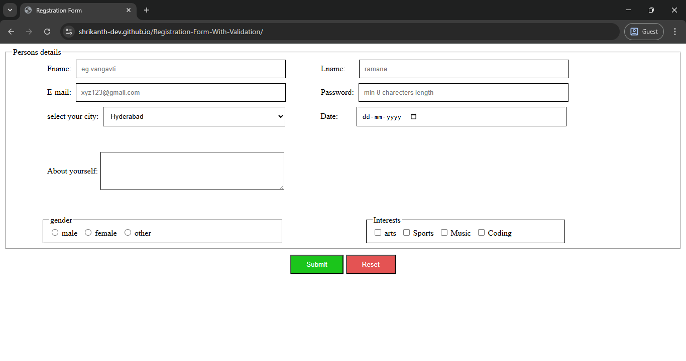

# Registration Form with Validation

## Table of contents

- [Overview](#overview)
  - [The challenge](#the-challenge)
  - [Screenshot](#screenshot)
  - [Links](#links)
  - [Built with](#built-with)
- [Author](#author)

## Overview

- This project is a responsive registration form built with HTML, CSS, and vanilla JavaScript. It includes:

- Inline form validation (name, email, password).
- Fieldset organization for clarity and accessibility.
- Custom hover and focus styles for a professional look.
- Responsive adjustments for mobile and tablet view.
- Organized layout for city selection, date picker, comments, gender, interests, and submit/reset buttons.

### The challenge

- Create a fully functional, styled registration form.

- Implement JavaScript validation without external libraries.

- Add interactive hover and focus states.

- Ensure responsive layout using Flexbox and media queries.

### Screenshot

### Links

- Solution URL: [solution URL](https://github.com/shrikanth-dev/Registration-Form-With-Validation)
- Live Site URL: [live site URL](https://shrikanth-dev.github.io/Registration-Form-With-Validation/)

### Built with

- HTML5

- CSS3 (Flexbox, Media Queries)

- JavaScript (Vanilla, Form Validation)

## Author

- Frontend Mentor - [@shrikanth-dev]
- LinkedIn - [@G Srikanth](https://www.linkedin.com/in/g-srikanth-gs)
